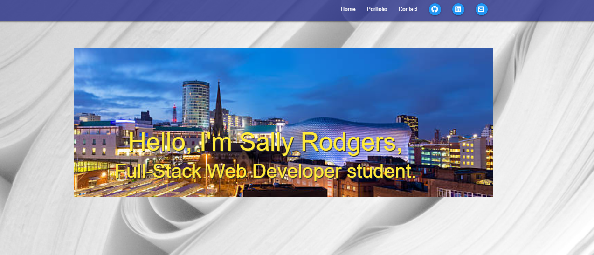
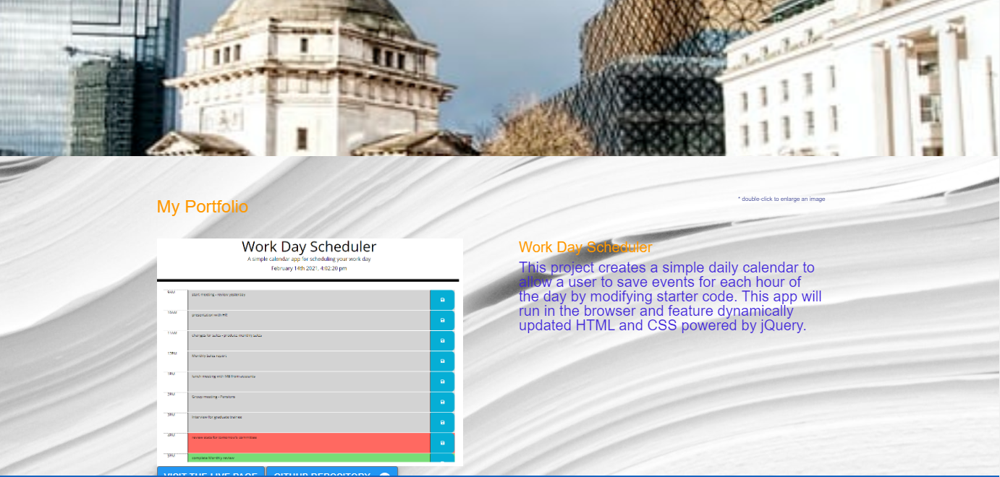
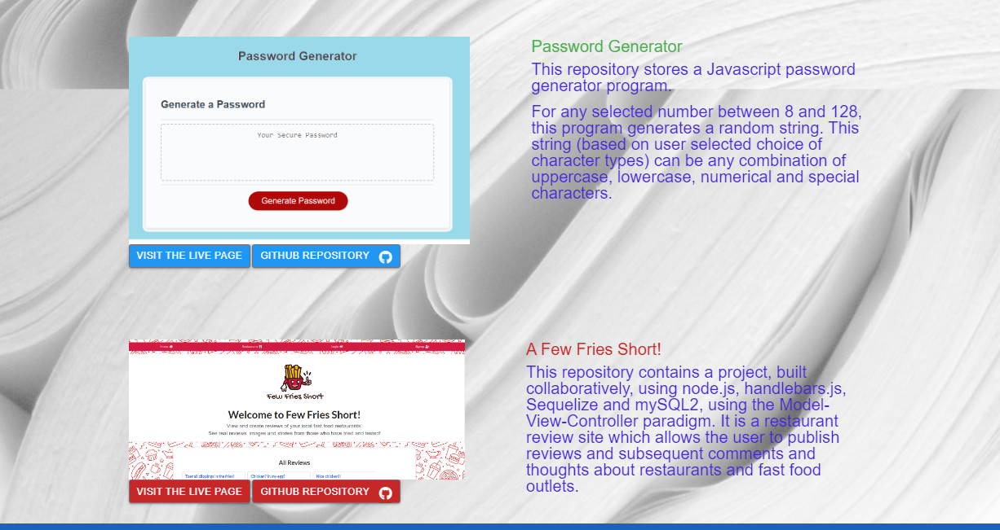

# Personal Portfolio
(formerly Professional-Materials)
This repository has been created to consolidate a 'first view' portfolio of early work created on my journey to become a Full Stack Web Developer.

1.  Link to CV: For further information, please email hellosally1@yahoo.com

2.  Link to Password Generator page: https://sallyxp.github.io/Password-Generator/

3.  Link to Work Day Scheduler: https://sallyxp.github.io/Work-Day-Scheduler/

# Installation Instructions

To run this webpage, click on the link below:

 https://sallyxp.github.io/Professional-Materials/ or open the HTML File with your default browser.
 
 # Usage
 
This repository contains an HTML page and associated files used to demonstrate my current abilities on my journey to become a Full Stack Web Developer. 

The site is one continuous web page, which is mobile-responsive, starting with a short biography.  The navigation bar navigates within the document, taking the user

and various icons & names of technologies used. Beneath the image is also a link to my CV, held on my Google Drive.  In addition this link is also listed above.

The next section contains a parallax image of Birmingham City Centre, and then below it, My Portfolio.

The first item is a Week-Day-Scheduler, there is a brief description of it, a screenshot, a link to its Github Repository and another link to the deployed webpage.

The second item is an earlier project, a random password generator.  There is again an image of its landing page, a brief description, a link to its Github Repository and 

also to its deployed website.

There is a small footer at the base of the page.

# Technologies Used

The site is written using HTML 5, CSS 3, Materialize, Bootstrap and JavaScript.  Images have been cited within the repository.  Public images have been obtained via 

unsplash.com.  Icons have been used from Font Awesome.

# Licence

The site is licensed with an MIT Licence - shown in the Github Repository.

# Contact Information

A link to my CV is above.  I am contactable on sallyhello1@yahoo.com.

Sally Rodgers

